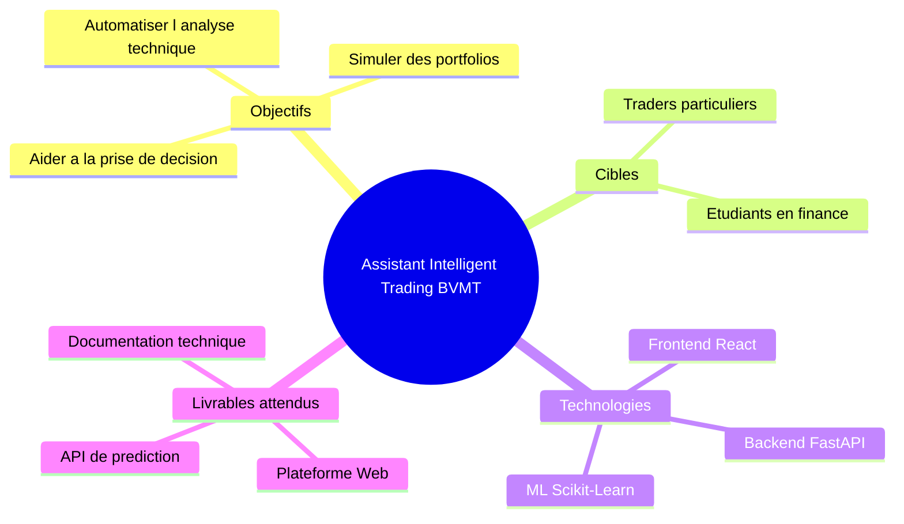
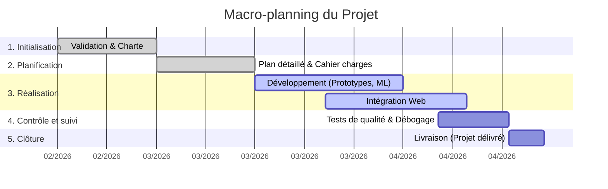

# Documentation - Phase d'Initialisation : Assistant Intelligent Trading BVMT

Ce document rassemble l'ensemble des livrables de la phase d'initialisation du projet.

---

## 1. Mind mapping du projet

Aperçu global des idées et de la structure du projet après validation :

---

## 2. Charte du Projet

**Nom du projet :** Assistant Intelligent Trading BVMT
**Chef de projet :** [À compléter]
**Sponsor / Client :** [À compléter]

**Description et Justification :**
Le marché financier tunisien (BVMT) manque d'outils accessibles pour les investisseurs particuliers intégrant de l'Intelligence Artificielle. Ce projet vise à démocratiser l'analyse technique et prédictive par le biais d'un assistant virtuel.

**Objectifs (SMART) :**
- **S**pécifique : Développer une plateforme d'aide à la décision boursière.
- **M**esurable : Atteindre un taux de précision directionnelle de plus de 80% sur le modèle ML.
- **A**tteignable : Utiliser des technologies maîtrisées (Python, React) et des données publiques.
- **R**éaliste : Limiter le périmètre à un "Paper Trading" (pas d'argent réel).
- **T**emporel : Finaliser le projet et livrer la V1 avant le 20 Avril 2026.

**Budget et Ressources :**
- **Ressources humaines** : 1 Tech Lead (IA/Backend), 1 Développeur Frontend, 1 Chef de projet.
- **Budget** : 0 TND (Utilisation d'outils open-source, données publiques et serveurs locaux/étudiants).

---

## 3. Macro-planning

Le macro-planning offre une vue de haut niveau sur les grandes phases du cycle de vie du projet.

---

## 4. Cartographie et Matrice des Parties Prenantes

Analyse des acteurs impliqués dans le projet pour adapter la stratégie de gestion.

| Partie Prenante | Rôle | Pouvoir | Intérêt | Stratégie (Action) |
| :--- | :--- | :---: | :---: | :--- |
| **Sponsor / Professeur** | Valide les jalons et évalue le projet | Fort | Fort | **Gérer de près** (Implication forte, rapports réguliers, validation) |
| **Équipe Projet** | Réalise les différents livrables | Fort | Fort | **Collaborer activement** (Mêlées quotidiennes, forte cohésion) |
| **BVMT (Bourse)** | Fournisseur des données (Passif) | Fort | Faible | **Maintenir satisfait** (Respecter la charge serveur lors du scraping) |
| **Utilisateurs Finaux** | Traders amateurs / Étudiants | Faible | Fort | **Informer** (Démos, tutoriels, recueil de feedbacks UX) |

---

## 5. Registre et Matrice des Risques

### Échelle de la Matrice (selon les règles) :
- 🟡 **Zone Jaune (Score de 1 à 3)** : Risque minimal, requiert une simple vigilance. Évolutif.
- 🟠 **Zone Orange (Score de 4 à 6)** : Risques gérables. Nécessite des actions préventives/correctives planifiées.
- 🔴 **Zone Rouge (Score de 7 à 9)** : Risque dangereux. Nécessite impérativement une intervention et un plan de secours.

*(Note : Score = Probabilité (1 à 3) × Impact (1 à 3))*

### Registre des Risques

| ID | Description du Risque | Probabilité (1-3) | Impact (1-3) | Score | Zone | Actions Préventives et Correctives |
| :-- | :--- | :---: | :---: | :---: | :---: | :--- |
| **R1** | **Biais ou imprécision du modèle ML** (Prédictions erronées). | 2 | 3 | **6** | 🟠 Orange | Commencer par un modèle simple (Régression linéaire) pour avoir une baseline. Ajouter un *Disclaimer* strict sur l'application. |
| **R2** | **Changement du format des données BVMT** (Le scraping échoue). | 3 | 2 | **6** | 🟠 Orange | Mettre en place des scripts de nettoyage (Pandas) très résilients et des alertes en cas de données manquantes. |
| **R3** | **Retard dans l'intégration API (Front/Back)** | 2 | 2 | **4** | 🟠 Orange | Définir les contrats d'API (Swagger/OpenAPI) très tôt et faire des tests d'intégration continus. |
| **R4** | **Perte de données ou faille de sécurité** | 1 | 3 | **3** | 🟡 Jaune | Chiffrer les mots de passe, utiliser des tokens JWT et versionner le code sur GitHub. |
| **R5** | **Surcharge serveur (Crash)** lors d'analyses lourdes | 1 | 2 | **2** | 🟡 Jaune | Utiliser l'asynchrone avec FastAPI. Surveiller la charge lors de la présentation. |

---

## 6. Procès-Verbal (PV) du Kick-off

**Date :** 15 Février 2026
**Lieu :** Visioconférence
**Présents :** Équipe de développement, Chef de projet.

**Ordre du jour :**
1. Présentation de la vision de l'Assistant Trading.
2. Validation de la Charte de projet.
3. Définition des responsabilités et de la stack technologique.
4. Planification des prochaines étapes.

**Décisions actées :**
- Le projet se limitera aux actions principales de la BVMT (exclusion des obligations complexes pour le MVP).
- La stack technologique est définitivement validée : **React** (Frontend), **FastAPI** (Backend) et **Scikit-learn** (IA).
- Les réunions de synchronisation auront lieu via Discord tous les jours à 18h (Daily de 15 minutes).

**Prochaines actions :**
- [x] Créer le dépôt GitHub et inviter les collaborateurs.
- [ ] Rédiger le cahier des charges détaillé (Planification).
- [ ] Initialiser l'environnement de développement local.
