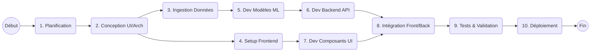
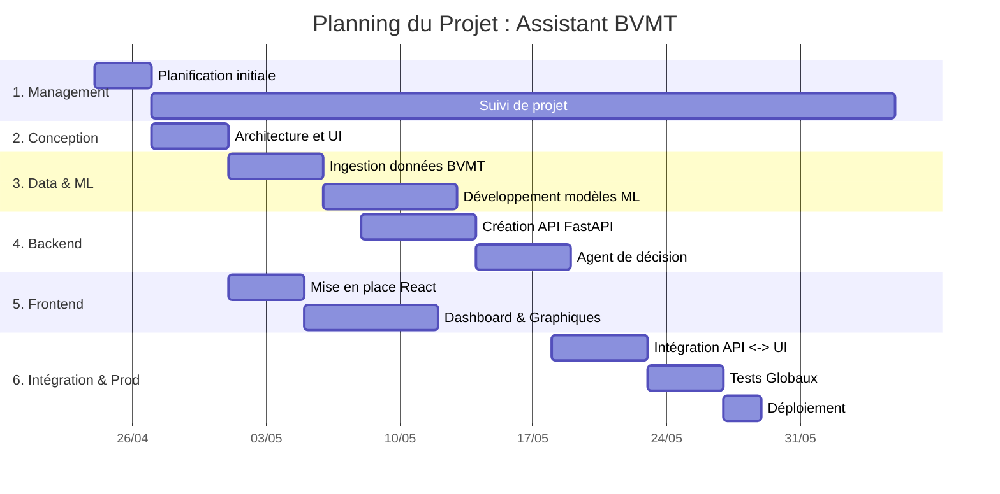

# Documentation - Phase Planification : Assistant Intelligent Trading BVMT

Ce document rassemble l'ensemble des livrables de la phase de planification pour l'adaptation du projet "Assistant Intelligent Trading BVMT" dans le cadre d'une gestion de projet.

---

## 1. Cahier des charges (Synthèse)

**Contexte et Objectif :**
Concevoir un assistant de trading intelligent (IA) dédié à la Bourse des Valeurs Mobilières de Tunis (BVMT) permettant d'analyser le marché, d'extraire des recommandations d'achat/vente personnalisées et de simuler la gestion de portefeuille.

**Périmètre fonctionnel :**
1. **Intelligence de marché** : Dashboard temps réel, détection d'anomalies, analyse des sentiments.
2. **Agent de décision** : Recommandations basées sur des modèles ML (RSI, Tendances, Volumes) et profils de risque (Conservateur, Modéré, Agressif).
3. **Gestion de portefeuille** : Paper trading, suivi de la performance (ROI, Ratio de Sharpe).

**Contraintes techniques :**
- Frontend : React, Recharts
- Backend : FastAPI (Python)
- Machine Learning : Scikit-Learn (Régression linéaire, Z-Score)
- Déploiement et Temps de réponse rapide (ex: <50ms pour la détection d'anomalies).

---

## 2. WBS (Work Breakdown Structure)

La structure de découpage du projet (OTP) :

```mermaid
wbs
  * Assistant Intelligent BVMT
    * 1. Management de Projet
      * 1.1 Cahier des charges
      * 1.2 Planification (Gantt, PERT)
      * 1.3 Réunions et Suivi
    * 2. Conception
      * 2.1 Architecture Système
      * 2.2 Maquettes UI/UX
      * 2.3 Modélisation des données
    * 3. Développement Data & ML
      * 3.1 Ingestion des données BVMT
      * 3.2 Modèles de prédiction des prix
      * 3.3 Moteur d'analyse des sentiments
    * 4. Développement Backend (API)
      * 4.1 Endpoints de marché
      * 4.2 Module Paper Trading
      * 4.3 Authentification et Sécurité
    * 5. Développement Frontend
      * 5.1 Dashboard Temps Réel
      * 5.2 Composants Graphiques
      * 5.3 Intégration API
    * 6. Tests et Déploiement
      * 6.1 Tests Unitaires/Intégration
      * 6.2 Recette Globale
      * 6.3 Mise en production
```

---

## 3. Réseau PERT

Le diagramme PERT illustre les dépendances entre les grandes tâches du projet.


*Chemin critique estimé : Planification -> Conception -> Données -> Modèles ML -> Backend API -> Intégration -> Tests -> Déploiement.*

---

## 4. Planning de Projet (Gantt)

Vue chronologique estimative du projet (sur une base de 6 semaines).



---

## 5. Matrice RACI

Attribution des rôles et responsabilités :
*(R: Réalise / A: Approuve / C: Consulté / I: Informé)*

| Tâches / Rôles | Chef de Projet | Lead Tech (Backend/IA) | Développeur Frontend | Client / Sponsor |
| :--- | :---: | :---: | :---: | :---: |
| Définir le cahier des charges | **A / R** | C | C | **C / A** |
| Choix de l'architecture | A | **R** | C | I |
| Développer le moteur ML | I | **R** | I | I |
| Créer l'API Backend | I | **R** | I | I |
| Développer les Vues React | I | C | **R** | I |
| Intégration des composants | I | **R** | **R** | I |
| Validation et Tests finaux | **R** | C | C | **A** |

---

## 6. Plan de Gestion de la Communication

Ce plan définit comment, quand et à qui les informations du projet seront distribuées.

| Type de communication | Format / Outil | Fréquence | Participants | Objectif |
| :--- | :--- | :--- | :--- | :--- |
| **Mêlée quotidienne (Daily)** | Discord / Teams (15 min) | Quotidienne | Equipe Projet | Point d'avancement, blocages. |
| **Revue de sprint / Point Avancement** | Visioconférence (1h) | Hebdomadaire | Equipe + Chef de Projet | Présenter ce qui est terminé (Démo). |
| **Comité de pilotage (Copil)** | Rapport PPT / Document | Mensuelle | Chef de projet + Sponsor | Valider les jalons, budget, et risques. |
| **Suivi des Tâches** | Jira / Trello | En continu | Equipe Projet | Affectation des tickets de développement. |
| **Documentation technique** | GitHub / README / Notion | En continu | Equipe Projet | Capitalisation des connaissances. |

---

## 7. Plan de Management de Projet (PMP)

Le **PMP** est le document cadre qui régit l'exécution du projet.

1. **Cycle de vie et Méthodologie** : Le projet sera mené en méthode **Agile (Scrum)** avec des itérations courtes (Sprints de 1 ou 2 semaines) afin de valider rapidement les performances des modèles d'IA.
2. **Gestion du périmètre (Scope)** : Toute modification du cahier des charges après le lancement devra passer par une demande de changement formelle validée par le Sponsor pour éviter les dérives (*Scope Creep*).
3. **Gestion des risques majeurs** :
   * *Qualité des données BVMT* (Risque: Modéré) : Données parfois incomplètes. -> Action : Mise en place de scripts de nettoyage avancés (Pandas).
   * *Performance de l'IA (Précision)* (Risque: Élevé) : Les prédictions ne sont pas assez précises. -> Action : Commencer par la régression linéaire pour avoir une baseline, puis itérer si besoin.
4. **Assurance Qualité** : Mise en place de tests unitaires sur la logique de trading. Validation de l'UI/UX par des wireframes avant développement.
5. **Gestion des Ressources** : Mobilisation d'un Data Scientist pour le back-end/ML et d'un développeur React pour le front-end. Utilisation des crédits Cloud gratuits/étudiants pour limiter le budget de l'infrastructure.
