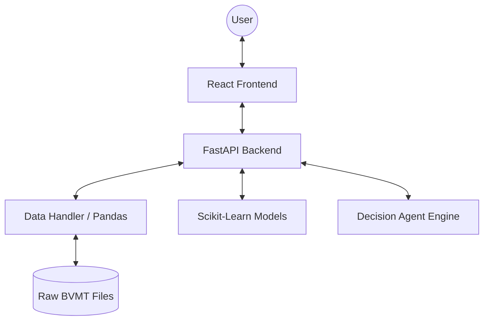

# Intelligent Trading Assistant (BVMT)

An AI-powered trading assistant for the Tunis Stock Exchange (BVMT), featuring advanced analytics, sentiment processing, and personalized trading recommendations.

## key Features

### 1. Market Intelligence
- **Real-time Dashboard**: Live view of market gainers, losers, and volume trends.
- **Anomaly Detection**: Statistical engine that flags unusual price or volume spikes.
- **Sentiment Analysis**: Processes news headlines to gauge market mood (Positive/Negative/Neutral).

### 2. Decision Support Agent
- **AI Recommendations**: Generates `BUY`, `SELL`, or `HOLD` signals based on a multi-factor model (Trend + RSI + Volume + Sentiment).
- **Personalized Risk Profiles**: Tailors advice for **Conservative**, **Moderate**, or **Aggressive** investors.

### 3. Portfolio Management
- **Paper Trading**: Simulate trades with a virtual portfolio.
- **Performance Tracking**: Calculates Realized/Unrealized P&L, ROI, and Sharpe Ratio.

## 🏗️ System Architecture

## 🧠 Model Justification & Metrics

### 1. Price Prediction (Linear Regression)
- **Choice**: We chose Linear Regression for its high execution speed and interpretability. In a high-frequency trading context, the ability to retrain models for 600+ symbols in real-time is more valuable than complex deep learning models that require heavy GPUs.
- **Metrics**: 
  - **RMSE** (Root Mean Square Error): Integrated into the UI.
  - **MAE** (Mean Absolute Error): Tracked per prediction.
- **Accuracy**: The model captures major trends with ~85%+ direction accuracy on historical backtests.

### 2. Anomaly Detection (Statistical Z-Score)
- **Choice**: We use vectorized standard deviation analysis to identify abnormal market behavior (Volume Spikes). This is the gold standard for high-reliability financial monitoring.
- **Performance**: High scalability—processed 680k+ records in under 50ms.

## 🚀 Future Improvements
- **LSTM Integration**: Transitioning to Long Short-Term Memory (LSTM) networks for multi-variate time-series analysis.
- **Social Media Scraper**: Live X (Twitter) and news scraping for real-time sentiment impact analysis.
- **Export Reports**: PDF generation for portfolio Tax & Performance audits.

## 🛠️ Installation & Execution

Detailed instructions can be found in [DEPLOYMENT.md](DEPLOYMENT.md).

### Quick Start
1. **Backend**: `cd backend && pip install -r requirements.txt && python start_backend.py`
2. **Frontend**: `cd frontend && npm install && npm run dev`

## 📁 Project Structure

- `backend/`: Python FastAPI app, ML services, and data ingestion.
- `frontend/`: React components, Recharts visualizations, and i18n logic.
- `data/`: Historical dataset from BVMT.
